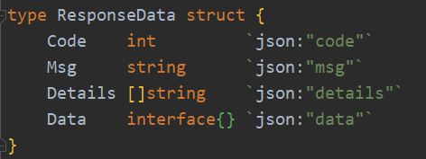
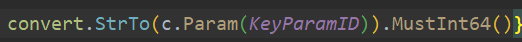
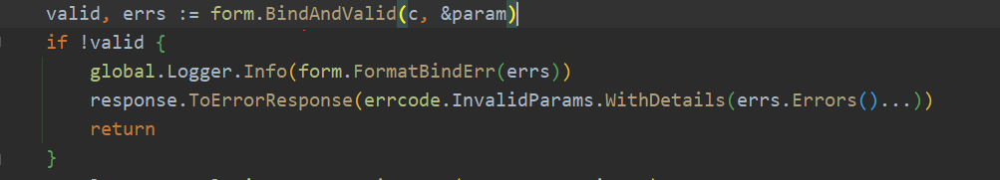

# 用于项目的格式化

## `app/app.go` 响应处理

1. 新建回应
   `func NewResponse(ctx *gin.Context) *Response `
2. 分为三种回复方式
    1. `func (r *Response) ToResponse(data interface{})`      回复一组数据
    2. `func (r *Response) ToResponseList(list interface{}, totalRows int)`  回复多组数据
    3. `func (r *Response) ToErrorResponse(err *errcode.Error)` 回复错误信息
3. 回复信息的字段分别为`错误码`,`错误信息`,`错误详细信息`,`数据`

## `app/pagination.go` 分页处理

从请求中解析 `page`和`page_size`字段

1. `func GetPage(c *gin.Context) int` 获取页数
2. `func GetPageSize(c *gin.Context) int` 获取页数大小
3. `func GetPageOffset(page, pageSize int) (result int)` 通过页数和页数大小计算偏移量

## `app/convert` 字符串格式转换的封装

将数字字符串转换为数字

## `app/errcode` 对错误码和错误处理的封装

## `app/form` 参数校验
使用样例:

